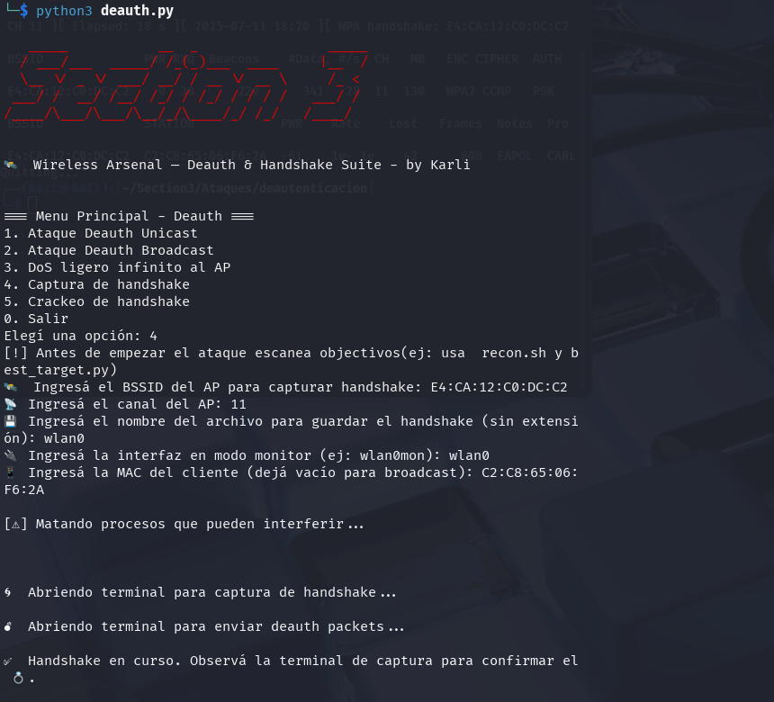
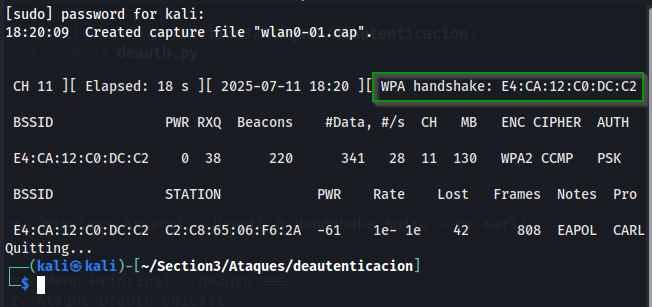

# 🛰️ Section 3 — Deauth & Handshake Suite

Módulo de ataques inalámbricos de **Section 3 — Wireless Arsenal**, diseñado para automatizar pruebas reales de desautenticación WiFi, captura de handshakes y crackeo de contraseñas WPA/WPA2.

Ideal para pentesters, laboratorios de ciberseguridad, investigación académica y uso educativo.

---

## 🧠 Funcionalidades incluidas

| Opción | Descripción                                                                 |
|--------|-----------------------------------------------------------------------------|
| 1      | Deauth Unicast: ataque a un cliente específico                              |
| 2      | Deauth Broadcast: ataque a todos los clientes del AP                        |
| 3      | DoS ligero infinito: paquetes sostenidos para mantener inestabilidad        |
| 4      | Captura de handshake: `airodump-ng` + `aireplay-ng` lanzados automáticamente|
| 5      | Crackeo de handshake usando `aircrack-ng` y wordlists                       |
| 0      | Salir del script                                                            |

---

## 🧰 Requisitos

- Sistema Linux (Kali o derivado)
- Python 3.x
- Suite `aircrack-ng` instalada
- Terminal gráfica (`gnome-terminal` o modificar para `xfce4-terminal`)
- Tarjeta WiFi con modo monitor (ej: Alfa AWUS1900)

---

## 🚀 Uso

```bash
sudo python3 deauth.py
```
## 💡 Ejemplo de flujo completo
Reconocimiento: Usá airodump-ng para identificar BSSID, canal y clientes.

Captura: Ejecutá la opción 4. Se abrirán dos terminales:

Una para capturar el handshake (airodump-ng)

Otra para forzar deauth (aireplay-ng)

Crackeo: Una vez capturado el handshake (verás un [ WPA handshake: <BSSID> ]), usá la opción 5.

Análisis: Si la contraseña está en la wordlist, aircrack-ng te la mostrará.





## 🛡️ Nota legal
Este proyecto está destinado exclusivamente a usos educativos, éticos y con consentimiento.
Section 3 no se responsabiliza por usos indebidos.

## Created by Karli
