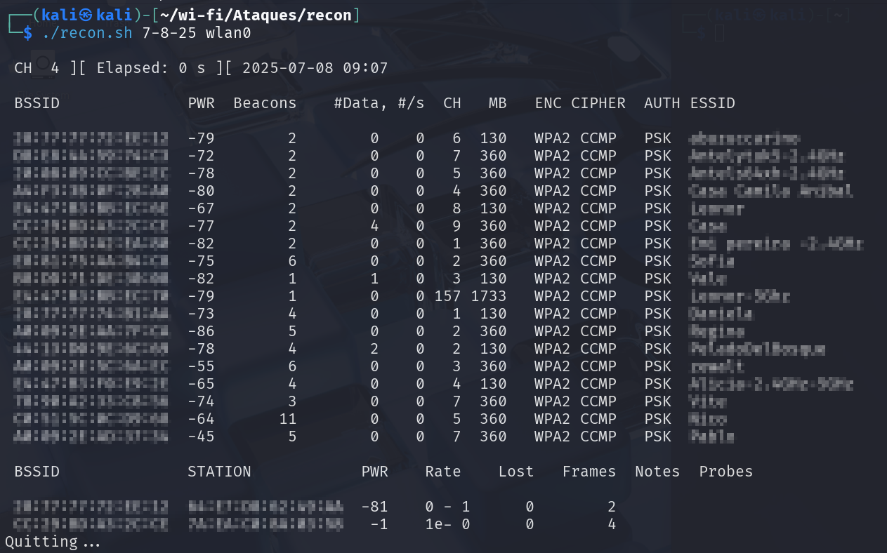
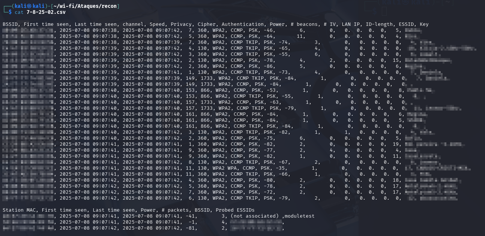
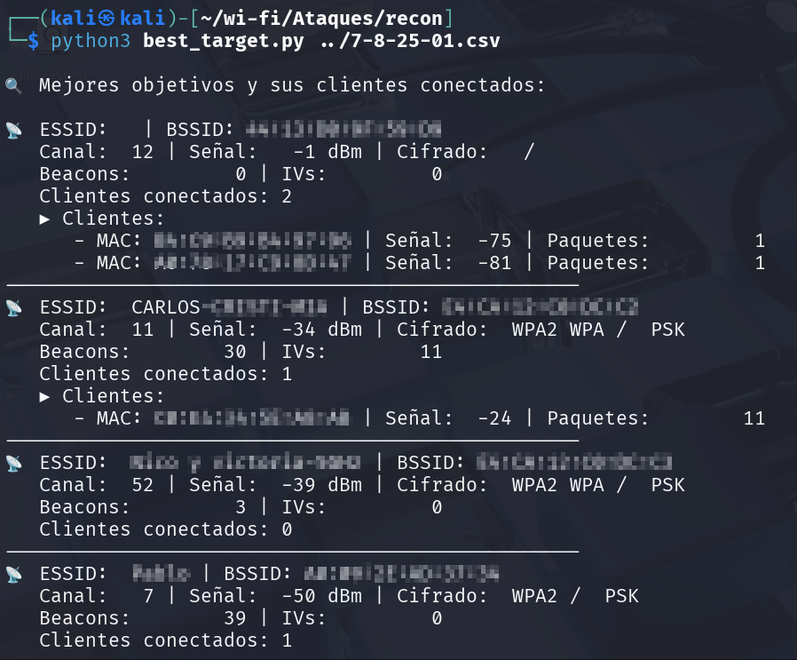

## 📊 Estructura del `.csv` generado por `recon.sh`

El archivo se divide en **dos bloques principales**:

---

### 🧱 1. Redes detectadas (Access Points)

Cada línea representa un punto de acceso (AP). Algunas columnas clave:

| Columna        | Significado práctico 💡                                                             |
|----------------|--------------------------------------------------------------------------------------|
| `BSSID`        | MAC del router                                                                      |
| `First/Last`   | Tiempo de detección (útil para saber si está activo aún)                            |
| `Channel`      | Canal de operación (frecuencia)                                                     |
| `Privacy`      | Tipo de seguridad (`WPA2`, `WPA3`, etc.)                                             |
| `Cipher`       | Cifrado utilizado (`CCMP`, `TKIP`)                                                   |
| `Authentication` | Método de autenticación (`PSK`, `SAE`...)                                         |
| `Power`        | Potencia de señal (más negativo = más lejos)                                        |
| `# beacons`    | Tramas beacon enviadas (si es muy bajo, puede ser un honeypot)                      |
| `# IV`         | Tramas cifradas útiles para crackear WEP (en WPA siempre 0)                         |
| `ESSID`        | Nombre de la red (SSID visible, puede estar vacío si es oculta)                      |

---

### 🧑‍💻 2. Estaciones (clientes conectados o buscando red)

Este bloque aparece **debajo** del listado de APs:

| Columna         | Significado práctico 💡                                                         |
|------------------|--------------------------------------------------------------------------------|
| `Station MAC`    | MAC del cliente (dispositivo conectado o buscando red)                         |
| `Power`          | Señal del cliente (puede servir para tracking o ataques dirigidos)             |
| `# packets`      | Paquetes enviados por el cliente durante el escaneo                            |
| `BSSID`          | A qué red está conectado (si dice `(not associated)` está buscando redes)       |
| `Probed ESSIDs`  | SSIDs que está buscando activamente (muy útil para ataques de spoofing)         |

---

### 🧠 Ejemplo real

A0:09:2E:5C:6A:EC, ..., 3, 360, WPA2, CCMP TKIP, PSK, -37, ...

- 📡 Red con `BSSID`: **A0:09:2E:5C:6A:EC**
- En **canal 3**
- Seguridad: **WPA2**
- Cifrado: **CCMP + TKIP (dual/mixed mode)**
- Autenticación: **PSK**
- Señal: **-37 dBm** → ¡Muy fuerte!
- ✅ Excelente candidata para capturar handshake

Y una estación (cliente):

C2:C8:65:06:F6:2A, ..., -49, 6, E4:CA:12:C0:DC:C2,

- 📱 Cliente con MAC **C2:C8:65:06:F6:2A**
- Señal fuerte
- Asociado a la red **E4:CA:12:C0:DC:C2** (BSSID)
- 🚨 Podés hacerle un **ataque de deauth** para forzar un handshake

---

### 🎯 ¿Cómo elegir un objetivo ideal?

- 📶 **Alta señal**: entre **-20 y -60 dBm**
- 👥 **Clientes conectados** (aparecen en la segunda sección)
- 📡 **Tráfico activo**: muchos `# packets` o `# beacons`
- 🔐 **Crackeable**: `WPA2-PSK` es el clásico

---

### 🔥 Nivel ninja

Tené en cuenta estas pistas:

- `Privacy: WPA3 WPA2` → **modo mixto**, permite **ataques de downgrade**
- `Cipher: CCMP TKIP` → también mixto, vulnerable a ataques tipo **TKIP downgrade**
- `WEP` → vulnerable a ataques directos con `aircrack-ng`

---

### Resultado de best_target.py

- Parsea el archivo generado por recon.sh y devuelve los mejores resultados con la informacion limpia para proyectar una strategia de ataque

  
